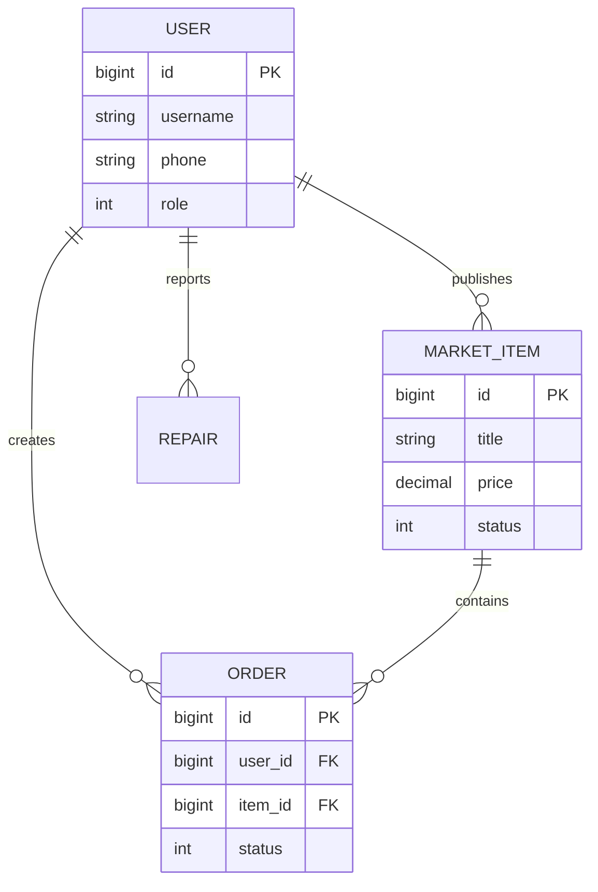

<div align="center">

<!-- 访客统计 (隐形装X) -->


<!-- 动态打字机效果 Banner -->
<a href="https://github.com/lxxxDD/campus-life-server">
  
</a>

<br>

<!-- 核心徽章矩阵 -->
<p>
  <a href="https://github.com/lxxxDD/campus-life-server">
    
  </a>
  <a href="https://github.com/lxxxDD/campus-life-server/issues">
    
  </a>
  <a href="https://github.com/lxxxDD/campus-life-server/stargazers">
    
  </a>
  <a href="https://github.com/lxxxDD/campus-life-server/commits">
    
  </a>
</p>

<!-- 技术栈徽章 -->
<p>
  
  
  
  
  
  
</p>

<br>

<h3 align="center">🚀 让校园生活从未如此极客</h3>

<p align="center">
  <a href="#-系统架构">🗺️ 系统架构</a> •
  <a href="#-数据模型">💾 数据模型</a> •
  <a href="http://localhost:8080/doc.html">📖 接口文档</a> •
  <a href="#-开发计划">📅 开发计划</a>
</p>

</div>

---

## 📊 极客统计 (GitHub Stats)

<div align="center">
  <table style="border: none;">
    <tr>
      <td style="border: none; padding-right: 20px;">
        
      </td>
      <td style="border: none;">
        
      </td>
    </tr>
  </table>
</div>

## 🗺️ 系统架构 (System Architecture)

```mermaid
graph TD
    Client["📱 移动端 / 💻 管理后台"] -->|RESTful API| Gateway["🌐 Nginx 网关"]
    
    subgraph "Core Server (Spring Boot)"
        Gateway --> Auth["🔐 认证授权 (JWT)"]
        Auth --> Controller["🎮 控制层 (Web)"]
        
        subgraph "Business Logic"
            Controller --> UserService["👤 用户服务"]
            Controller --> MarketService["🛒 市场服务"]
            Controller --> LifeService["🌈 生活服务"]
        end
        
        Business Logic --> MP["🛠️ MyBatis-Plus"]
    end
    
    subgraph "Data Storage"
        MP --> MySQL[("🗄️ MySQL 主库")]
        LifeService --> Redis[("🚀 Redis 缓存")]
        MarketService --> OSS[("☁️ 文件存储")]
    end
    
    subgraph "External"
        LifeService --> AI["🤖 AI 大模型接口"]
    end

    style Client fill:#f9f,stroke:#333,stroke-width:2px
    style Gateway fill:#bbf,stroke:#333,stroke-width:2px
    style Core Server fill:#dfd,stroke:#333,stroke-width:2px
    style Data Storage fill:#ffd,stroke:#333,stroke-width:2px
```

## 🧬 核心流程 (Core Process)

```mermaid
sequenceDiagram
    participant U as User
    participant C as Client
    participant S as Server
    participant DB as Database
    participant R as Redis

    U->>C: 输入账号密码
    C->>S: POST /api/login
    S->>DB: 验证用户凭证
    DB-->>S: 用户信息
    S->>S: 生成JWT Token
    S->>R: 缓存用户信息 (Exp: 7d)
    S-->>C: 返回 Token
    
    Note over C, S: 后续请求携带 Token
    
    C->>S: GET /api/user/profile (Header: Authorization)
    S->>S: 解析并校验 Token
    S->>R: 获取用户缓存
    R-->>S: UserDTO
    S-->>C: 返回用户资料
```

<details>
<summary><b>🔐 点击查看：JWT认证鉴权时序图</b></summary>
<br>



</details>

## 💾 数据模型 (ER Diagram)

<details>
<summary><b>�️ 点击查看：核心业务ER关系图</b></summary>
<br>



</details>

## 📅 开发计划 (Roadmap)

```mermaid
gantt
    title Campus Life Server 开发路线图
    dateFormat  YYYY-MM-DD
    section 基础建设
    数据库设计       :done,    des1, 2024-11-01, 7d
    后端框架搭建     :done,    des2, 2024-11-08, 5d
    认证模块开发     :done,    des3, 2024-11-13, 5d
    section 业务开发
    二手市场模块     :done,    feat1, 2024-11-20, 10d
    食堂点餐模块     :done,    feat2, 2024-12-01, 10d
    校园报修模块     :active,  feat3, 2024-12-10, 7d
    section 智能化
    AI助手接入       :         ai1,   2024-12-15, 5d
    数据大屏开发     :         ai2,   2024-12-20, 5d
```



## ⚡ 核心能力 (Core Capabilities)

| 领域 | 核心功能 | 技术实现 |
| :--- | :--- | :--- |
| **🔐 安全架构** | JWT无状态认证、RBAC权限模型 | `HandlerInterceptor`, `@CheckToken` |
| **🚀 高性能** | 多级缓存架构、连接池优化 | `Redis`, `HikariCP` |
| **💬 即时通讯** | WebSocket全双工通信 | `ServerEndpoint` |
| **🤖 AI集成** | 智能对话上下文管理 | `OkHttp`, `SSE` |
| **📝 文档工程** | 自动化接口文档 | `Knife4j`, `Swagger 3` |

## 🚀 极速部署 (Quick Start)

```bash
# 1. ⬇️ 下载神器的源代码
git clone https://github.com/lxxxDD/campus-life-server.git

# 2. 🚀 进入发射基地
cd campus-life-server

# 3. 💣 装填弹药 (数据库)
# 执行 sql/init.sql 初始化数据库结构

# 4. ⚙️ 调整参数
# vim src/main/resources/application.yml

# 5. 🔥 点火发射！
mvn spring-boot:run
```

## 🤝 贡献者 (Contributors)

<a href="https://github.com/lxxxDD/campus-life-server/graphs/contributors">
  
</a>

---

<div align="center">

**Code with ☕ and ❤️**

[](https://star-history.com/#lxxxDD/campus-life-server&Date)

</div>

